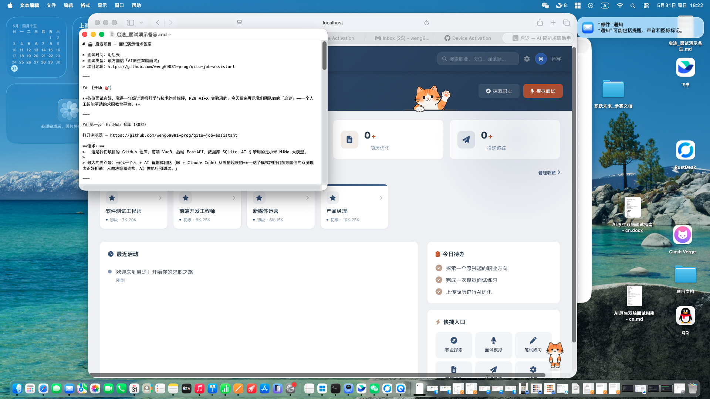
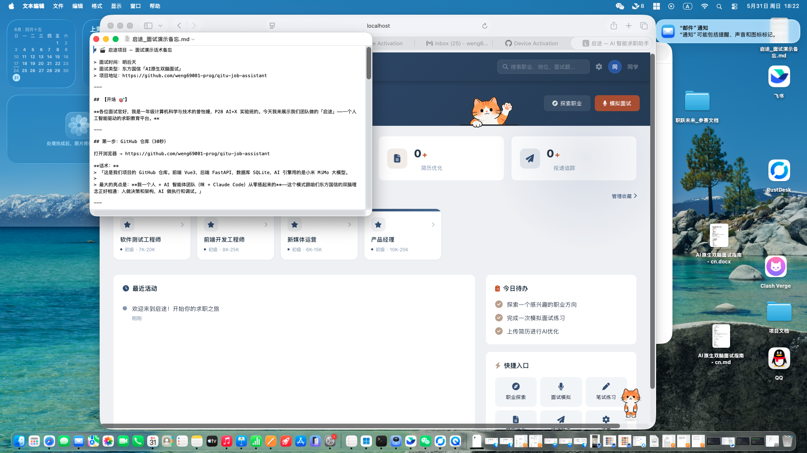
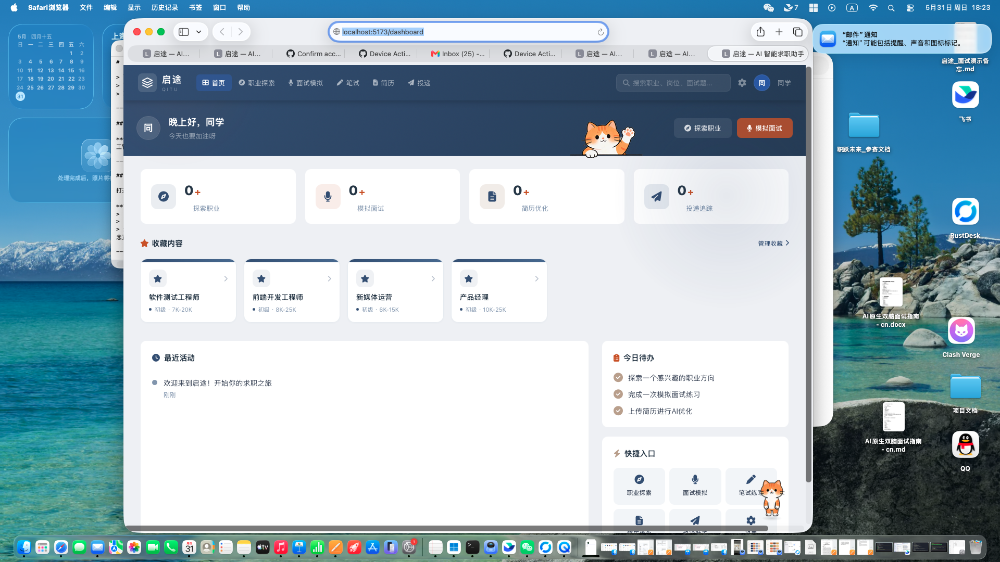
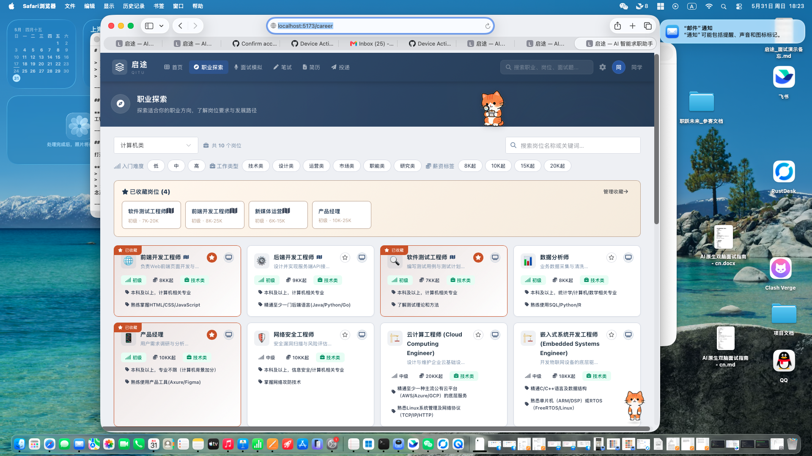
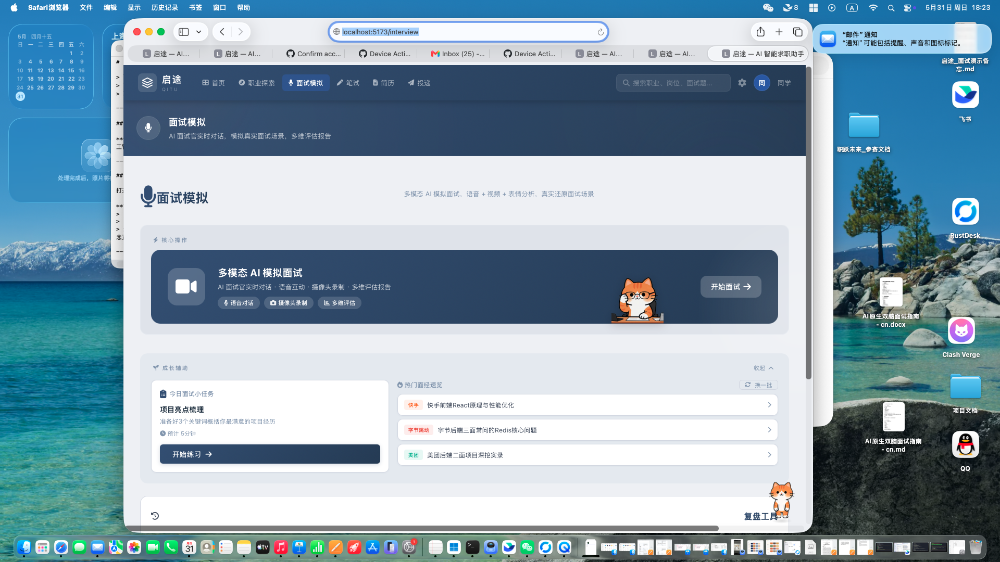
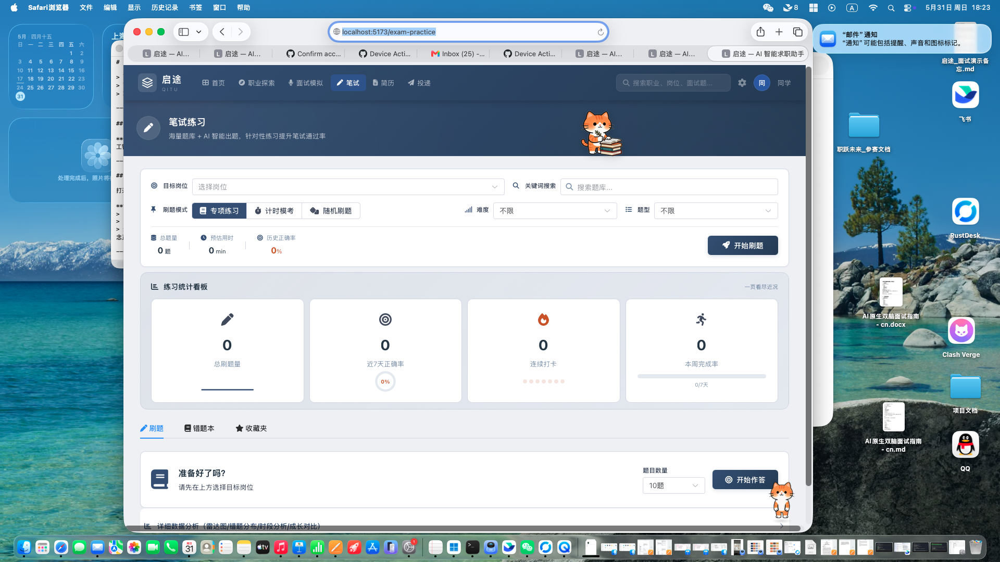
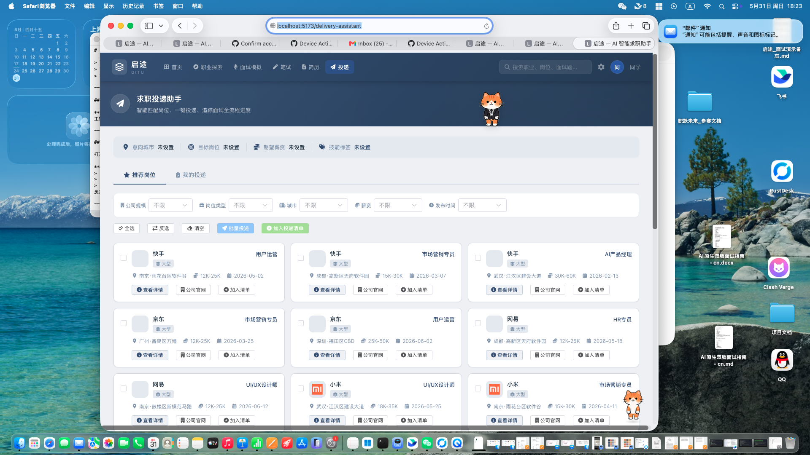
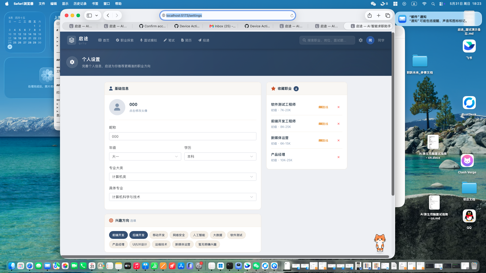

# 启途 (Qitu) — AI 求职教育平台

<p align="center">
  
  
  
  
  
</p>

> **大一学生 × AI 智能体**：一个人带一个 AI 团队，从零构建的全栈 AI 求职教育平台。

---

## 📸 功能截图

<p align="center">
  
  
</p>
<p align="center">
  <em>欢迎页 & 登录/注册页</em>
</p>

<p align="center">
  
</p>
<p align="center">
  <em>首页仪表盘 — 欢迎横幅 + 收藏汇总 + AI助手小橘</em>
</p>

<p align="center">
  
</p>
<p align="center">
  <em>职业探索 — AI推荐 + 三级职业图谱 + 成长路径</em>
</p>

<p align="center">
  
</p>
<p align="center">
  <em>面试模拟 — 对话式AI面试官 + 面部表情分析 + 评估报告</em>
</p>

<p align="center">
  
  
</p>
<p align="center">
  <em>笔试练习（左）& 投递助手（右）</em>
</p>

<p align="center">
  
</p>
<p align="center">
  <em>设置页 — 个人信息编辑 + 头像上传</em>
</p>

---

## 🚀 快速开始

### 前置条件

- Python 3.9+
- Node.js 18+

### 1. 启动后端

```bash
cd backend
pip install -r requirements.txt
python main.py
```

后端运行在 http://localhost:8000

> **AI 配置**：在 `backend/.env` 中设置 LLM 的 API Key 和模型（支持 MiMo / SiliconFlow）

### 2. 启动前端

```bash
cd frontend
npm install
npm run dev
```

前端运行在 http://localhost:5173

---

## ✨ 功能模块

### 🎯 职业探索
AI 驱动的智能职业推荐。输入专业、兴趣，系统自动匹配合适职业方向，展示**职业详情**（工作内容、薪资范围、能力要求）、**三级职业图谱**、**成长路径**（含证书推荐、学习资源、任务清单）。

### 🎤 面试模拟
**核心模块** — 对话式 AI 面试官（非死板一问一答）：
- 选择岗位 → AI 智能出题 → 对话式追问 → 实时面部表情分析 → 完整评估报告
- **面试历史**：每次面试的完整记录与复盘
- **错题本**：答错题目分类整理，支持「待回顾 / 已掌握」标记
- **收藏夹**：好题目一键收藏，支持练习模式
- 支持摄像头开启，AI 分析表情（紧张 / 自信 / 困惑等）

### 📝 笔试练习
三层筛选（行业 → 岗位 → 题型），AI 自动生成笔试题，支持多题型、限时作答、错题自动收录。

### 📄 简历优化
上传现有简历或 AI 生成新简历，提供 AI 润色建议，针对目标岗位优化内容。

### 📊 投递助手
- **推荐岗位**：AI 智能匹配推荐
- **我的投递**：全流程追踪（已查看→待面试→面试中→Offer→已关闭）
- 面试安排管理、批量投递、数据概览统计

### 🏠 首页仪表盘
登录后的统一入口：
- 欢迎横幅 + 快速导航
- **收藏汇总**：职业收藏 / 视频收藏 / 面试题收藏 / 笔试收藏 — 一个入口全看到
- 右下角**AI 助手小橘**：可拖拽、双击换装、定时鼓励、陪伴式求职体验

### ⚙️ 设置
头像上传、个人信息编辑、密码修改。

---

## 🏗️ 技术栈

| 层级 | 技术 | 说明 |
|------|------|------|
| **前端** | Vue 3 + Vue Router + Pinia | 响应式 SPA |
| **UI** | Element Plus + Font Awesome | 组件库 + 图标 |
| **构建** | Vite 5 | 极速开发体验 |
| **后端** | Python FastAPI | 高性能异步 API |
| **数据库** | SQLite + SQLAlchemy | 轻量级本地存储 |
| **AI 引擎** | 小米 MiMo 大模型 | 对话 / 面试出题 / 表情分析 / 简历优化 |
| **备选 AI** | SiliconFlow API | 模型降级方案 |

### 后端 API 路由

```
career/      → 职业探索与推荐
interview/  → 面试模拟与评测
exam/       → 笔试练习
resume/     → 简历优化
delivery/   → 投递追踪
job_match/  → 岗位匹配
user/       → 用户管理
bilibili/   → B 站视频资源
assistant/  → AI 助手交互
llm.py      → LLM 统一调用封装（支持 MiMo / SiliconFlow）
```

---

## 🧑‍💻 项目结构

```
interview-agent/
├── backend/                  # Python FastAPI 后端
│   ├── main.py               # 入口 & 路由注册
│   ├── models.py             # SQLAlchemy 数据模型
│   ├── database.py           # 数据库连接
│   ├── routers/              # API 路由模块
│   ├── .env                  # AI API 配置（不提交）
│   └── requirements.txt      # Python 依赖
├── frontend/                 # Vue 3 前端
│   ├── src/
│   │   ├── views/            # 页面组件
│   │   ├── components/       # 通用组件（Banner、Logo、吉祥物）
│   │   ├── stores/           # Pinia 状态管理
│   │   ├── router/           # 路由定义
│   │   └── assets/           # 静态资源
│   └── package.json          # 前端依赖
└── README.md
```

---

## 🎓 项目背景

本项目由 **P28 项目（AI+X 实验班）** 团队开发，企业方为科大讯飞，导师马菲菲。

**团队：**
- 👩‍💻 **曾怡嫚**（组长）— 工学部计算机科学与技术 大一
- 申梓淼、牛保康

**开发模式：**
> 组长一个人 + AI 智能体团队（咪 / Claude Code）
> 
> 从零构思 → 全栈构建 → AI 测试 → 产品上线，展示了人与 AI 高效协同的「双脑开发模式」。

---

## 📬 联系我们

- 项目地址：https://github.com/weng69081-prog/qitu-job-assistant
- 如有问题或建议，欢迎提 Issue 或 PR！